# dbnet

## 摘要
最近，在场景文本检测中，基于段方法是十分流行的，因为段的结果能够更精确的描述各种形状的场景，如曲线文本。
对于段基检测，二值化的后处理是必不可少的，它用一种段方法把概率图转换为文本边界/区域的边缘图。
本文推荐使用可微分的二值化方法。既能简化后处理，又能增强文本检测的效果。
实际上，使用一个轻量级的骨架，由 DB 带来的能力的提升十分巨大，所以我们在检测精度和效率之间进行这种。采用以 ResNet-18的骨架。
code: https://github.com/MhLiao/DB

## 介绍
段基场景识别，吸引了很多注意力，因为它可以描述不同类型的文本，有利于像素级的预测结果。
大多数段基方法要求复杂的后处理，分组像素级的预测结果到探测文本实力，这导致在推理阶段产生相当大的时间花销。
大多数现存检测方法使用相似的去处理流程, 如图所示，图二中的蓝线
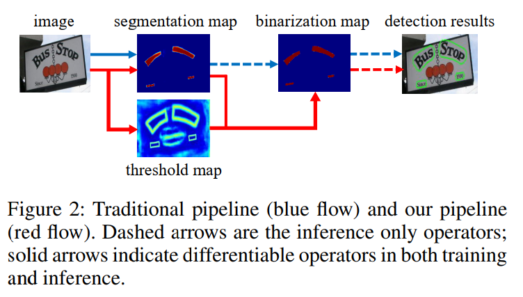
首先，设置一个固定的阈值，用段网络将一个概率图转换为二值化图片。
然后，使用一些启发式的方法，来组合像素到文本实例中。
或者，我们的流程目的是插入二值化操作到段网络中，进行联合优化。图2中的的红线。这种方法，图片中的每个地方的阈值都是调整性的预测，这能够完全区分前景和背景的像素。
由于标准的二值化函数不能微分，因此我们采用一个近似的二值化方法，叫做可微分的二值化（Differentiable Binarization，DB），这是完全可微的，当和段网络一起训练的时候。

这篇论文的主要贡献是推荐了一个 DB 模块，这使得CNN网络中端到端的二值化处理变得可训练的。
通过结合一个简单的语义段网络和推荐的 DB 模块，我们推荐一个鲁棒性好且更快的场景探测器。
从使用 DB 模块的能力效果来看，我们的探测器由很多优异的好处:
1. 我们的方法在 5 个benchmark 上一直保持更好的效果，包括垂直、水平、多角度、曲线文本
2. 比之前的领先方法更快。
3. 当使用轻量级的骨架时，DB 工作十分的好。
当骨架使用 ResNet18 的时候，文件检测的功能显著的增加。
4. 因为 DB 可以从推断阶段中移除，而且不增加性能的损失。因此对于测试来说，没有额外的内存/时间开销。

## 相关工作
目前，场景文本检测方法大致分为两类：基于回归的方法和基于段的方法。

**基于回归的方法** 是使用直接回归文本实例的边界箱(bounding boxes) 的模型。  
目前有：
- TextBoxes
  - 修改锚点和基于 SSD 卷积和的尺寸。
- TextBoxes++
  - 应用基于四边形(quadrilaterals)回归来检测多方向文本。
- DMPNet
  - 和 *TextBoxes++* 一样
- SSTD
  - 建议一种专注机制(attention mechanism),粗略的识别文本区域。
- RRD
  - 通过使用分类的旋转不变性的特征和回归旋转敏感的特征，将分类和回归进行分离。
  - 在多方向和长文本识别中有更改好的效果。
- EAST
  - 使用自由锚点方法。
  - 对于多方向文本，应用像素级的回归。
- DeepReg
  - 和 *EAST*一样。
- SegLink
  - 回归段的包围盒(bounding boxes)，并预测他们之间的链接，来处理长文本场景。
- DeRPN
  - 推荐一种维度分解区域推荐网络(dimension-decomposition region proposal network)，处理场景文本检测中的尺度问题。
基于回归的方法通常喜欢简单的后处理算法(如非极大值抑制(non-maximum suppression).
但是他们中的大多出受限于非常规形状的包围盒的精度问题，如曲线形状。  
**基于段的方法** 通常结合像素级的预测和后处理算法来获取包围盒。
目前存在的情况：
- 通过语义段和 MSER(Maximally Stable Extrernal Regions，最稳定极值区域) 检测多方向文本。
- Text border
  - 被用在切分文本实例
- Mask TextSpotter
  - 探测随机形状的文本实例
  - 基于 Mask R-CNN 的实例切分方法
- PSENet
  - 逐步尺度扩展
  - 使用不同的尺度核对文本实例进行切割。
- 像素嵌入( Pixel Embedding)
  - 从分段结果中聚类像素点
- PSENet & SAE 
  - 提出新的后处理算法，对于分段结果
  - 降低的推断速度

本文的方法聚焦于提升分段的结果，通过在训练期间使用二值化算法，而且没有损失推断速度

**快速场景文本检测方法** 聚焦于精确度和推断速度。
- TextBoxes, TextBoxes, SegLink 和 RRD 实现了更快的文本探测，使用 SSD 的检测架构。
- EAST 使用 PVANet 提高它的速度

他们的大多出不能处理不规则形状的文本实例。
本文的方法不仅更快，而且能够检测出任意的形状的文本实例。

-------
## 方法
架构如图所示
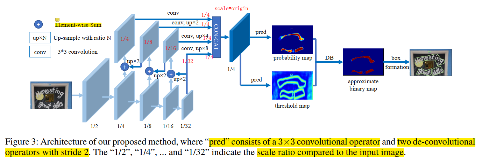

step 1. 输入图片喂到特征金字塔骨架中。  
step 2. 金字塔特征通过上采样(up-sampled)到相同尺度，并且级联起来，产生特征图 F  
step 3. 特征图 F 用来预测 概率图(P) 和与制图(T)
step 4. 近似二值化图(B^)由 P 和 F 计算得出。

在训练周期中，对概率图，阈值图和二值化图进行家督。这里概率图和阈值图可以共享同一个监督。
在推断期间，包围盒可以通过近似二值化图或者概率图中，采用 box formulation 模块很容易获取。

### 二值化
**标准二值化(Standard Binarization)**
给定由段网络产生的概率图 P∈$R^{H·W}$ ， 这里 $H$ 和 $W$ 是指图的高和宽。这是转换到二值化图 $P∈R^{H·W}$ 的十分重要的部分。这里的像素值是1，被认为是 有效的文本区域。
二值化的公式：
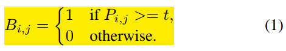  
上式是标准二值化。这里的 $t$ 是预定义的阈值，(i,j) 是图上的坐标点

**可微分的二值化**  
由公式1可知，标准的二值化不可微。
采用近似的二值化方法：  
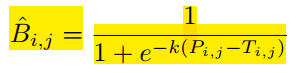  

这里 $\hat{B}$ 是近似二值化图。$T$ 是适配的阈值图，从网络中学到。 $k$ 是幅度参数。*经验值是 $k=50$*

可微分的二值化，带有适配的阈值，不仅可以帮助从背景中区别文本区域，而且能够将十分靠近的文本实例进行分开。

DB 提高效果的原因可以用梯度回传来进行解释。(见原论文)  
~~我们用二值交叉熵损失作为例子。~~
~~定义 $f(x)=\frac{1}{1+e^{-kx}}$ 是 DB 公式。这里的 $x=P_{i,j}-T_{i,j}$ ~~

下面的公式显示的是 正 label 损失和 负 Label 损失：
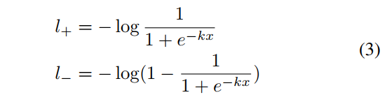  

可以计算出损失的微分是：  
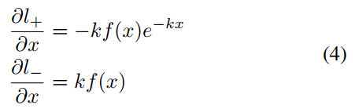

从可微中，可以得到：  
1. 梯度可以通过幅度系数 $k$ 进行强化
2. 对于大多数错误预测情况，梯度的幅度是十分重要的。

另外，因为 $x=P_{i,j}-T_{i,j}$ ，$P$ 的梯度受到影响，并且会重新度量，在前景和背景之间，通过 $T$

## 可适配的阈值
虽然图1中的阈值图和文本边界图相似。但是阈值图的动机和使用和文本边界图不同。  
阈值图能够高亮文本边界区域，甚至对阈值图没有进行监督。这指明类边界阈值图对最终结果有利。  
因此在阈值图上使用了边界监督，为了更好的引导。  

我们的阈值图是为了二值化图服务的。

## 可形变的卷积
可形变的卷积(Deformable convolution) 能够提供一个灵活的感受野。  
配有可形变的卷积，都采用了 3x3 的卷积层，在 ResNet18 中的第三层、第四层和第五层。

## 标签生成
概率图的文本生成是受到 PSENet 的启发。  
给定一个文本图片，它的文本区域的多项式通过一系列的段进行描述：  
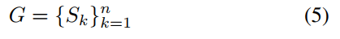  
$n$ 是顶点的数量，这个不同的数据集都是不同的。
- e.g. 
  - ICDAR 2015 数据集上，这个值是 4
  - CTW1500 的数据集上，这个值是 16  

之后，正区域通过压缩多项式 $G$ 到 $G_s$ 来生成，使用 Vatti clipping algorithm。
压缩偏置 D 是由周长 $L$ 和面积 $A$计算得到的。  
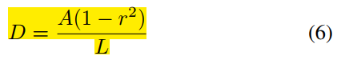  
这里 r 是指压缩比，经验值 0.4

采用相似的流程，我们可以生成阈值图的标签。
1. 文本多项式 $G$ 采用相同的 偏置 D 膨胀到 $G_d$ .
2. 认为 $G_s$ 和 $G_d$ 之间的区域是文本的边界，这里阈值图的标签可以通过计算 G 中最近的段的距离来得到。

## 优化
损失函数 L 可以描述为一个权重和： 概率图的损失 $L_s$， 二值图的损失 $L_b$, 和阈值图的损失 $L_t$:  
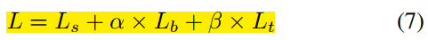  

根据损失值的数值， $\alpha$ 和 $\beta$ 可以分别设为 1.0 和 10

使用二值交叉熵(binary corss-entropy,BCE)损失在 $L_s$ 和 $L_b$ 上。  
为了克服正样例和负样例数量上不平衡的问题，使用 Hard Negative mining 到 BCE 上，通过采样 Hard Negatives.   
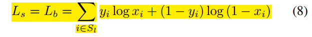  
$S_l$ 是采样的集合，这里的正样例和负样例的比值是 1:3

$L_t$ 采用计算 预测和标签之间的 L1 距离，在膨胀文本区域内。
多项式 $G_d$ 是：
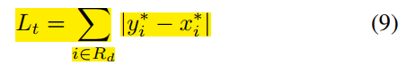  
$R_d$ 是 $G_d$ 中的像素值索引的集合。 $y^*$ 是阈值图的标签。

在推断期间，使用概率图或者近似二值化图生成文本边界盒。  
为了更好的效率，使用概率图，以至于阈值图可以被移除。  
盒信息处理过程由下面几步组成：
1. 概率图/近似二值图首先采用一个常量阈值(0.2)进行二值化，得到二值化图。
2. 连接区域(压缩的文本区域)从二值图中获取
3. 压缩的区域进行膨胀，使用 Vatti clipping algorithm，偏置是 $D'$ 。$D'$ 的计算公式是：  
   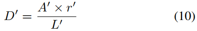  
   这里， $A'$ 是压缩多项式(shunk polygen)的区域。 $L'$ 压缩多项式的周长， $r'$ 是 1.5， 经验值。

## 实验
### 数据集
**SynthText**  
- 800k 图片
- 由 8k 张背景图合成

**MLT-2017 dataset** 
- 多语言数据集
  - 9种语言，6中脚本
  - 7200张训练图， 1800张验证图， 9000张测试图

**ICDAR 2015 dataset** 
- 1000张训练图， 500张测试图组成
- 分辨率是 720 x 1280
- 单词级别的 label

**MSRA-TD500 dataset**
- 多语言数据集，包含中英文
- 300张训练图， 200张测试图
- 文本行级别的 label
- 本文中额外使用了 400 张测试图片，从 HUST-TR400

**CTW1500 dataset**
- 聚焦于权限文本
- 包含 1000张训练图，500张测试图
- 文本注释是 文本行级别。

**Total-Text dataset**
- 包含不同形状的文本，包含水平、多方向、曲线。
- 1255张训练图片，300张测试图片
- 单词级别的 label

## 实现细节
对于所有的模型，
- 先使用 SynthText数据集，与训练 100k 个迭代。
- 然后在响应的真实世界数据集中进行微调，运行 1200 轮。
- 训练的 batch size 是 16
- 按照 poly learning rate policy. 
  - 当前迭代的学习率等于最初的学习率乘上一个系数。
  - 系数是 $(1-\frac{iter}{max_iter})^{power}$
  - 这里，初始学习率是 0.007, $power$ 是 0.9
- 采用 0.0001 的权重衰弱，动量是 0.9
- $max_iter$ 是指 最大的迭代，这里依赖于 最大的 epochs

训练数据的增强包含：
- 随机旋转，旋转角度在 (-10°, 10°) 之间。
- 随机裁切
- 随机反转

所有的才处理后的图片都进行重新放缩到 640x640， 为了更好的训练效率。   
推断周期，保持测试图片的横纵比(aspect ratio)布片，并放缩到输入图片的尺寸，设置合适的高度。  
~~推断速度采用 batch size 为 1 ， 1080ti GPU，单线程~~  
推断时间花销包含 模型的前向传播时间和后处理时间花销。
后处理时间花销大约占推断时间的 30%

## 消融研究(Ablation Study)

### 可微分的二值化(differentiable binarization)

### 可形变的卷积 (Deformable convolution)

### 在阈值图上监督 (Supervision of Threshold map)

### 骨架 （backbone)

## 和之前的方法的对比

### 曲线文本检测

### 多方向文本检测

### 多语言文本检测

## 限制
不能处理文本嵌套。  

## 结论

